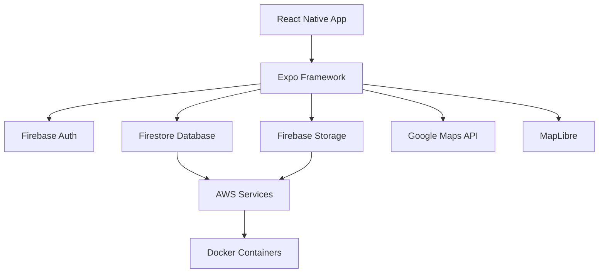
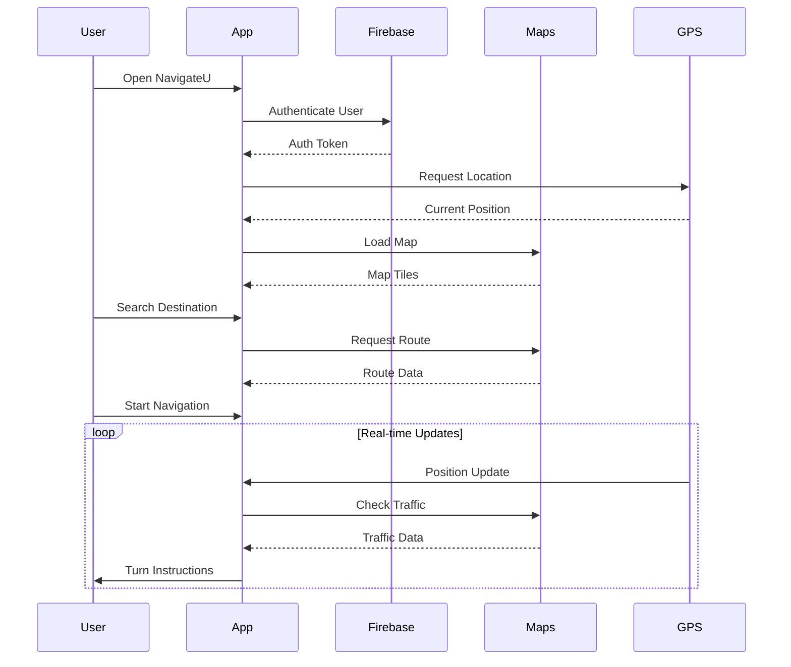
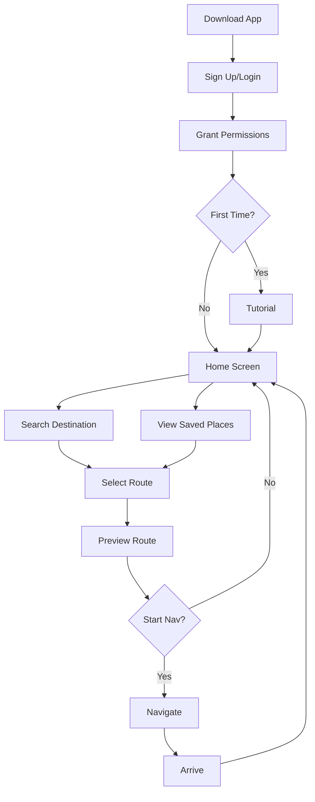
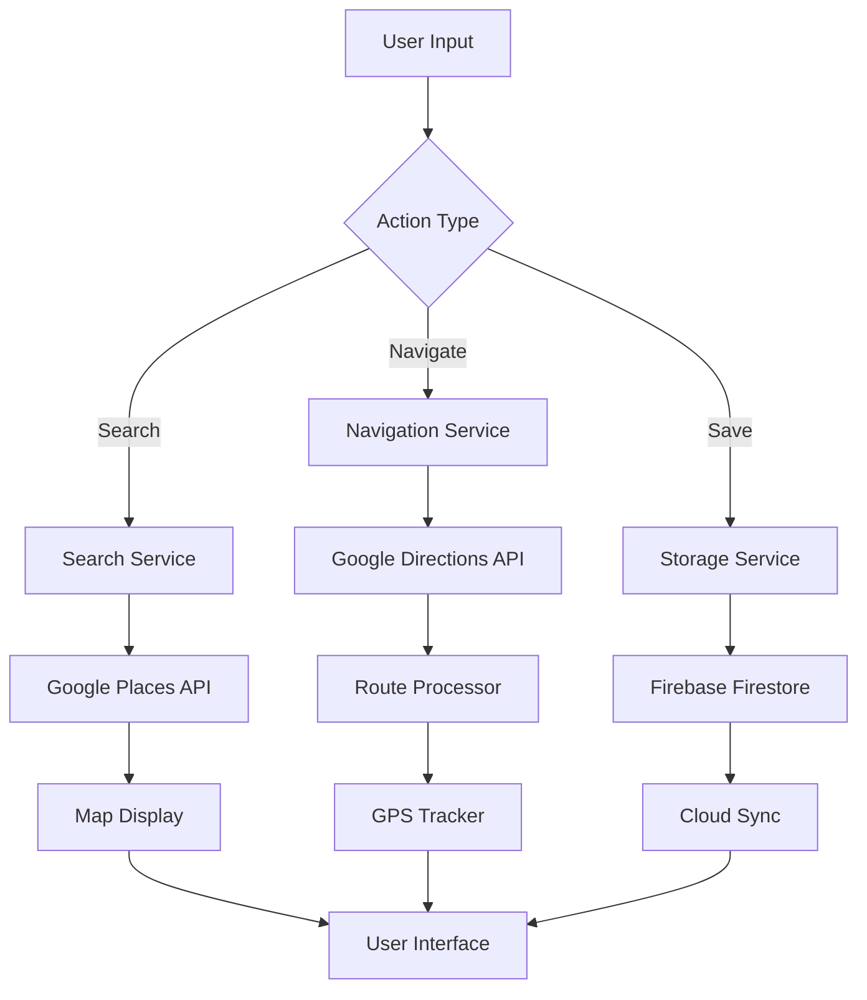

<div align="center">

# NavigateU

<br/>

<div>
  
  
  
  
  
  
  
  
  
  
</div>

<br/>

**A modern mobile navigation application built with React Native and Expo, providing intelligent route planning, real-time location tracking, and seamless map integration for enhanced travel experiences.**

<p>
  <a href="#about-the-project">About</a> •
  <a href="#key-features">Features</a> •
  <a href="#getting-started">Getting Started</a> •
  <a href="#contributing">Contributing</a> •
  <a href="#license">License</a>
</p>

</div>

## About The Project

NavigateU is a cross-platform mobile navigation application designed to provide users with intuitive, reliable, and feature-rich navigation capabilities. Built with modern technologies including React Native and Expo, the app delivers a seamless experience for route planning, real-time location tracking, and interactive map visualization across Android devices.

## What It Does

NavigateU is your complete navigation companion that helps you get from point A to point B efficiently. Here's what makes it powerful:

###  Smart Navigation
- Get turn-by-turn directions with voice guidance
- Choose from multiple route options to find the fastest path
- Receive real-time traffic updates and automatic rerouting
- Add multiple stops along your journey for complex trips

###  Location Intelligence
- Track your real-time location with precise GPS
- Discover nearby restaurants, gas stations, and attractions
- Save your favorite locations for instant access
- Review your complete navigation history

###  Advanced Mapping
- Interactive maps with pan, zoom, and rotate capabilities
- Switch between map, satellite, and terrain views
- Download maps for offline navigation
- Place custom markers for personalized locations

###  Multi-Modal Transportation
- Driving directions optimized for vehicles
- Walking routes for pedestrians
- Cycling paths for bike riders
- Public transit options with schedules

###  Cloud-Powered Features
- Sync favorites and preferences across all your devices
- Secure user authentication and profile management
- Access your saved data from anywhere
- Automatic cloud backup of your navigation data

###  Cross-Platform Experience
- Optimized for Android devices
- Smooth performance powered by React Native
- Responsive design that works on tablets and phones

Whether you're commuting to work, exploring a new city, or planning a road trip, NavigateU has you covered!

### Built With

This project leverages cutting-edge mobile development technologies and cloud infrastructure for optimal performance and scalability.

* **Mobile Framework:** [Expo](https://expo.dev/)
* **UI Framework:** [React Native](https://reactnative.dev/)
* **Programming Language:** [TypeScript](https://www.typescriptlang.org/)
* **Backend Services:** [Firebase](https://firebase.google.com/)
* **Mapping Services:** [Google Maps API](https://developers.google.com/maps), [MapLibre](https://maplibre.org/)
* **Platform:** [Android](https://developer.android.com/)
* **Build Tool:** [Gradle](https://gradle.org/)
* **Cloud Infrastructure:** [AWS](https://aws.amazon.com/)
* **Containerization:** [Docker](https://www.docker.com/)

## Architecture Overview



## System Flow Diagram



## Key Features

* **Real-Time Navigation:** Turn-by-turn navigation with voice guidance
* **Interactive Maps:** High-quality map rendering with multiple layer options
* **Route Optimization:** Intelligent route planning with traffic awareness
* **Location Services:** Accurate GPS tracking and location-based services
* **Offline Maps:** Navigate even without internet connectivity
* **Multi-Modal Transport:** Support for driving, walking, cycling, and transit
* **Points of Interest:** Discover nearby places, restaurants, and attractions
* **Save Favorite Locations:** Quick access to frequently visited destinations
* **Cross-Platform:** Seamless experience across Android devices
* **Cloud Sync:** Synchronize preferences and saved locations via Firebase

## Screenshots

<div align="center">
  
  
  
  
</div>

> 📸 Add your app screenshots in the `docs/screenshots/` folder

## Performance Metrics

<div align="center">

| Metric | Value | Description |
|--------|-------|-------------|
| ⚡ App Launch Time | < 2s | Time to interactive |
| 🗺️ Map Load Time | < 1s | Initial map render |
| 📍 GPS Accuracy | ±5m | Location precision |
| 🔋 Battery Impact | Low | Optimized for efficiency |
| 📦 App Size | ~25MB | Minimal footprint |
| 🚀 Route Calculation | < 500ms | Path finding speed |

</div>

## Technology Stack Breakdown

### Frontend
```
├── React Native (UI Framework)
├── Expo (Development Platform)
├── TypeScript (Type Safety)
├── React Navigation (Routing)
└── React Native Maps (Map Component)
```

### Backend & Services
```
├── Firebase Authentication (User Management)
├── Cloud Firestore (NoSQL Database)
├── Firebase Storage (File Storage)
├── Google Maps API (Mapping Service)
├── MapLibre (Open Source Maps)
└── AWS (Cloud Infrastructure)
```

### DevOps
```
├── Docker (Containerization)
├── Gradle (Build Tool)
├── GitHub Actions (CI/CD)
└── Expo EAS (Build Service)
```

## Getting Started

To get a local copy up and running for development, follow these simple steps.

### Prerequisites

You will need Node.js (version 16 or higher), npm or yarn, Expo CLI, and Android Studio (for Android development) installed on your system.

Install Expo CLI globally:
```sh
npm install -g expo-cli
```

### Installation

1.  **Clone the repository:**
    ```sh
    git clone https://github.com/neutron420/NavigateU.git
    cd NavigateU
    ```

2.  **Install dependencies:**
    ```sh
    npm install
    # or
    yarn install
    ```

3.  **Set up environment variables:**
    Create a `.env` file in the root of your project with the following variables:
    ```env
    GOOGLE_MAPS_API_KEY=your_google_maps_api_key
    FIREBASE_API_KEY=your_firebase_api_key
    FIREBASE_AUTH_DOMAIN=your_firebase_auth_domain
    FIREBASE_PROJECT_ID=your_firebase_project_id
    FIREBASE_STORAGE_BUCKET=your_firebase_storage_bucket
    FIREBASE_MESSAGING_SENDER_ID=your_firebase_messaging_sender_id
    FIREBASE_APP_ID=your_firebase_app_id
    AWS_REGION=your_aws_region
    AWS_ACCESS_KEY_ID=your_aws_access_key
    AWS_SECRET_ACCESS_KEY=your_aws_secret_key
    ```

4.  **Start the development server:**
    ```bash
    npm start
    # or
    yarn start
    # or
    expo start
    ```

5.  **Run on Android:**
    ```bash
    npm run android
    # or
    yarn android
    ```

6.  **Build for production:**
    ```bash
    expo build:android
    ```

## Project Structure

```
NavigateU/
├── src/
│   ├── components/      # Reusable UI components
│   ├── screens/         # Application screens
│   ├── navigation/      # Navigation configuration
│   ├── services/        # API and service integrations
│   ├── utils/           # Utility functions
│   ├── hooks/           # Custom React hooks
│   ├── contexts/        # React context providers
│   └── assets/          # Images, fonts, and static files
├── android/             # Android native code
├── ios/                 # iOS native code (if applicable)
├── App.tsx              # Application entry point
├── app.json             # Expo configuration
├── package.json         # Dependencies
└── tsconfig.json        # TypeScript configuration
```

## Core Functionality

### Navigation Features
* **Turn-by-Turn Directions:** Real-time navigation with voice instructions
* **Route Alternatives:** Multiple route options with estimated times
* **Traffic Updates:** Live traffic information and rerouting
* **Waypoints:** Add multiple stops along your route

### Map Features
* **Interactive Maps:** Pan, zoom, and rotate map views
* **Layer Control:** Switch between map, satellite, and terrain views
* **Location Markers:** Custom pins for saved locations
* **Geofencing:** Location-based notifications and triggers

### User Features
* **Profile Management:** User authentication and profile customization
* **Favorites:** Save and organize frequent destinations
* **History:** View past navigation sessions
* **Preferences:** Customize map style, units, and navigation settings

## Deployment

### Android Deployment

1. Build the production APK:
   ```bash
   expo build:android -t apk
   ```

2. Or build an App Bundle for Google Play:
   ```bash
   expo build:android -t app-bundle
   ```

### Using Docker

```bash
docker build -t navigateu .
docker run -p 19000:19000 navigateu
```

## API Integration

### Google Maps API
Configure your Google Maps API key in the environment variables and ensure the following APIs are enabled:
* Maps SDK for Android
* Directions API
* Places API
* Geocoding API

### Firebase Services
The app uses Firebase for:
* Authentication (Firebase Auth)
* Real-time database (Firestore)
* Cloud storage (Firebase Storage)
* Push notifications (Firebase Cloud Messaging)

## User Journey Flow



## Data Flow Architecture



## Roadmap

### Phase 1: Core Features ✅
- [x] Basic map navigation
- [x] Turn-by-turn directions
- [x] User authentication
- [x] Save favorite locations

### Phase 2: Enhanced Features 🚧
- [ ] Offline map support
- [ ] Voice commands
- [ ] AR navigation
- [ ] Multi-stop route planning

### Phase 3: Advanced Features 📋
- [ ] Social features (share routes)
- [ ] Public transit integration
- [ ] EV charging station locator
- [ ] Weather integration
- [ ] Parking availability

### Phase 4: Platform Expansion 🎯
- [ ] iOS version
- [ ] Web application
- [ ] Smartwatch companion app
- [ ] CarPlay/Android Auto integration

## Contributing

Contributions are what make the open-source community such an amazing place to learn, inspire, and create. Any contributions you make are **greatly appreciated**.

If you have a suggestion that would make this better, please fork the repo and create a pull request. You can also simply open an issue with the tag "enhancement".

1.  Fork the Project
2.  Create your Feature Branch (`git checkout -b feature/AmazingFeature`)
3.  Commit your Changes (`git commit -m 'Add some AmazingFeature'`)
4.  Push to the Branch (`git push origin feature/AmazingFeature`)
5.  Open a Pull Request

## License

Distributed under the MIT License. See `LICENSE` for more information.

## Resources

* [Expo Documentation](https://docs.expo.dev/)
* [React Native Documentation](https://reactnative.dev/docs/getting-started)
* [Google Maps Platform](https://developers.google.com/maps)
* [Firebase Documentation](https://firebase.google.com/docs)
* [MapLibre Documentation](https://maplibre.org/maplibre-gl-js-docs/)

## Project Stats

<div align="center">


</div>

## Acknowledgments

* [Expo Team](https://expo.dev/) for the amazing development platform
* [React Native Community](https://reactnative.dev/) for the powerful framework
* [Google Maps Platform](https://developers.google.com/maps) for mapping services
* [Firebase](https://firebase.google.com/) for backend infrastructure
* [MapLibre](https://maplibre.org/) for open-source mapping
* [Icons8](https://icons8.com/) for beautiful icons
* All our contributors and supporters

## Support

If you found this project helpful, consider giving it a ⭐️!

For support, email support@navigateu.com or join our Slack channel.

## Contact

Project Link: [https://github.com/neutron420/NavigateU](https://github.com/neutron420/NavigateU)

---

<div align="center">
Made with ❤️ by the NavigateU Team
</div>
